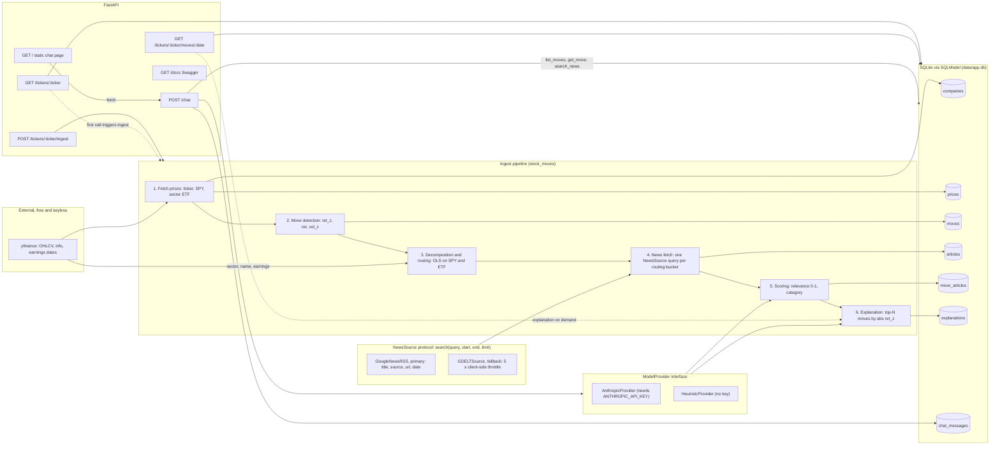
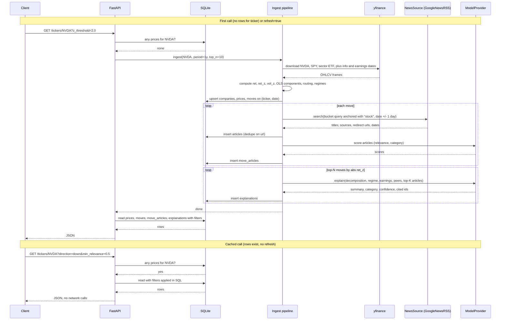
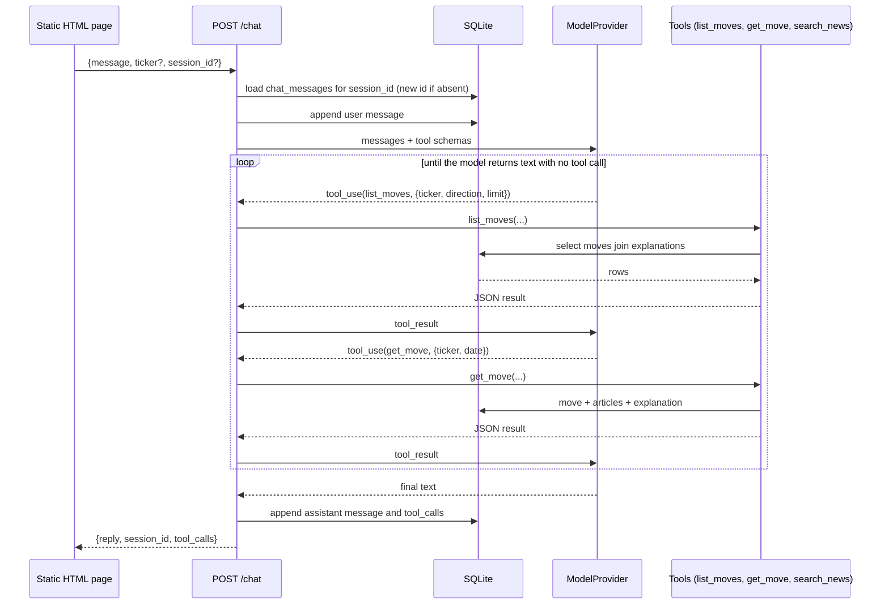

# Architecture v1 — local prototype

## Summary

v1 is a single FastAPI process backed by SQLite that explains major daily stock moves with news. For a ticker it pulls daily OHLCV from `yfinance` (ticker, `SPY`, sector ETF), flags "major" days by a rolling z-score of returns, decomposes each move into market / sector / idiosyncratic components with a trailing OLS, and uses that decomposition to route a news query (company, industry, or macro vocabulary) in a ±1 day window through a `NewsSource` protocol; `GoogleNewsRSS` is the primary source and `GDELTSource` the fallback. A `ModelProvider` scores each article for relevance and category and writes a structured explanation with citations and a confidence; the `AnthropicProvider` is used when `ANTHROPIC_API_KEY` is set, otherwise a `HeuristicProvider` runs on keyword rules and the numbers. Everything is cached in SQLite, populated lazily on the first `GET /tickers/{ticker}`. A `POST /chat` endpoint runs a tool-calling loop over the same read functions, and a static HTML page plus Swagger sit on top. The app runs with zero API keys.

## Component diagram

## Lazy populate: `GET /tickers/{ticker}`

Filters (`z_threshold`, `pct_threshold`, `direction`, `category`, `min_relevance`, `start`, `end`, `limit`) are applied at read time against stored columns. Changing a threshold never triggers re-ingest.

## Chat: `POST /chat` as a tool-calling loop

With no key the `HeuristicProvider` picks a tool by keyword ("biggest", "drop", a date, "news"), runs it once, and fills a templated reply. Same endpoint, same response shape, no streaming.

## Data model

All tables are SQLModel classes in SQLite. `id` is an autoincrement integer unless noted.

### `companies`

| column | type | notes |
|---|---|---|
| `ticker` | text | primary key |
| `name` | text | from `yfinance` `info` |
| `sector`, `industry` | text | from `yfinance` `info` |
| `sector_etf` | text | static dict sector → XLK/XLF/XLE/... |
| `peers_json` | text | list of peer tickers from one cached LLM call; `[]` without a key |
| `updated_at` | datetime | |

### `prices`

| column | type | notes |
|---|---|---|
| `id` | int | pk |
| `ticker`, `date` | text, date | **unique (ticker, date)**; ingest is idempotent on this |
| `open`, `high`, `low`, `close`, `volume` | real | raw OHLCV |
| `ret`, `gap_ret`, `intraday_ret` | real | close→close, prev close→open, open→close |
| `ret_z` | real | `ret` / trailing 20-day std of `ret` |
| `vol_z` | real | volume / trailing 20-day mean volume |
| `mkt_component`, `sector_component`, `idio_component` | real | trailing 60-day OLS on SPY and sector ETF |
| `routing` | text | `company`, `industry`, or `macro` (largest abs component) |
| `regime_mkt`, `regime_sector` | text | `bull` or `bear`, 50 vs 200 day SMA |
| `near_earnings` | bool | within ±1 trading day of a `yfinance` earnings date |

### `moves`

| column | type | notes |
|---|---|---|
| `id` | int | pk |
| `ticker`, `date` | text, date | **unique (ticker, date)**; fk to `prices` on the same pair |
| `ret`, `ret_z`, `vol_z` | real | copied from `prices` so filters and ordering do not need a join |
| `direction` | text | `up` or `down` |
| `routing` | text | copied from `prices` |
| `peer_comove` | real | mean same-day return of peers, null if no peers |

A row exists for any day with `abs(ret_z) >= 2.0` or `abs(ret) >= 0.02` at ingest; stricter thresholds are query-time filters.

### `articles`

| column | type | notes |
|---|---|---|
| `id` | int | pk |
| `url` | text | **unique**; dedupe key (a Google redirect URL for RSS items) |
| `title`, `source` | text | headline and outlet name |
| `language` | text | nullable; GDELT sets it, RSS does not |
| `published_at` | datetime | item date from the source |
| `news_source` | text | `google_news_rss` or `gdelt` |
| `fetched_at` | datetime | |

### `move_articles`

| column | type | notes |
|---|---|---|
| `move_id` | int | fk `moves.id`; **composite pk (move_id, article_id)** |
| `article_id` | int | fk `articles.id` |
| `relevance` | real | 0–1 from the provider |
| `category` | text | `company`, `industry`, or `macro` |
| `provider` | text | `anthropic` or `heuristic`; v2 trains only on `anthropic` rows |

### `explanations`

| column | type | notes |
|---|---|---|
| `id` | int | pk |
| `move_id` | int | fk `moves.id`; **unique** — one cached explanation per move |
| `summary` | text | |
| `primary_category` | text | `company`, `industry`, `macro`, or `unexplained` |
| `confidence` | real | 0–1 |
| `cited_article_ids_json` | text | list of `articles.id` |
| `unexplained` | bool | |
| `provider` | text | `anthropic` or `heuristic` |
| `created_at` | datetime | |

### `chat_messages`

| column | type | notes |
|---|---|---|
| `id` | int | pk |
| `session_id` | text | indexed; generated if the request omits it |
| `role` | text | `user`, `assistant`, `tool` |
| `content` | text | |
| `tool_calls_json` | text | nullable; tool name and args for assistant turns |
| `created_at` | datetime | |

## Why these choices

- **z-score over a fixed 2%.** 2% is a big day for KO and a quiet day for a small cap. `ret_z` normalises by the ticker's own recent volatility, so "major" means the same thing across tickers. `pct_threshold` stays as a query param because the prompt suggests it, but z is the definition.
- **Decomposition as routing, not as the answer.** The OLS split into market / sector / idiosyncratic is not causal. It is used to pick which news query to run, so the model reads company news for company moves and macro news for macro moves. Peer co-movement is the second, independent industry signal.
- **A `NewsSource` protocol with Google News RSS as primary.** Probed with no keys on 2026-09-15: one query returns 100 dated, sourced items, `after:`/`before:` operators give a historical date window, outlets are mainstream, and there is no throttle. The cost: title, source, url and date only, no body, and the url is a Google redirect, so URL dedupe is on the redirect and the body cannot be fetched from it later. Scoring is on the headline.
- **GDELT DOC 2.0 as the second implementation.** Also keyless and historical since 2015, and it adds a language field. The cost: one request per five seconds, enforced client-side, so a one-year ingest with ~25 moves and one query each takes about two minutes on GDELT versus seconds on RSS. It is the fallback, or the primary when `NEWS_SOURCE=gdelt`.
- **Queries anchored to the market.** The company query is `"<name>" stock` plus the ticker, not the bare name, so a common name does not return obituaries and sports.
- **SQLite, no vector DB.** The join between a move and its news is a date window (±1 day), not a semantic match. A `WHERE published_at BETWEEN` on one file is the whole retrieval. A vector store would add a dependency and nothing to recall in v1.
- **Provider interface so the app runs with zero keys.** `ModelProvider` has two implementations behind one signature. The heuristic path is not a stub; it produces relevance, category, and a templated explanation from the same inputs, so every endpoint and test works offline.
- **Top-N explanation as the cost control.** Only the N largest moves by `abs(ret_z)` get an LLM explanation on ingest. Any other move is explained on first request and cached. Token spend scales with N, not with the number of moves.
- **Plain JSON chat, no SSE.** The tool loop runs a handful of SQLite reads and one or two model calls; a single JSON response keeps the client a `fetch` call and keeps the endpoint testable with one assertion.

## Known limitations

- Attribution, not causation: the explanation says what the news said on the day, not what moved the price.
- Both news sources give headlines only; scoring cannot see article bodies. Coverage of small caps is thin.
- RSS urls are Google redirects, so the same story reached through two redirect urls is stored twice; GDELT is throttled to one request per five seconds.
- The 60-day OLS is a rough factor model; betas are noisy on volatile names and near regime changes.
- Sector ETF mapping is a static dict; conglomerates and misclassified `yfinance` sectors route badly.
- Peers come from one LLM call and are empty without a key, so peer co-movement is missing in heuristic mode.
- Confidence is uncalibrated; `unexplained` reflects the model's opinion, not a measured error rate.
- No scheduled ingest; data goes stale until `?refresh=true`.
- Single-day moves only; multi-day drifts and gap-then-reversal patterns are not modeled.
- No executive or social commentary sources.
- SQLite on local disk; not deployable as-is to a serverless host.
