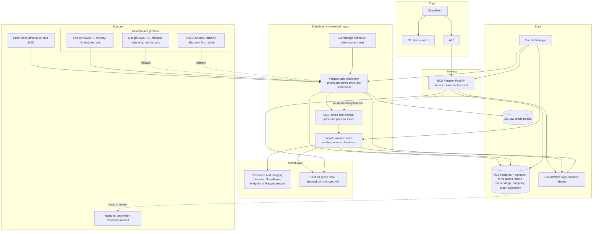
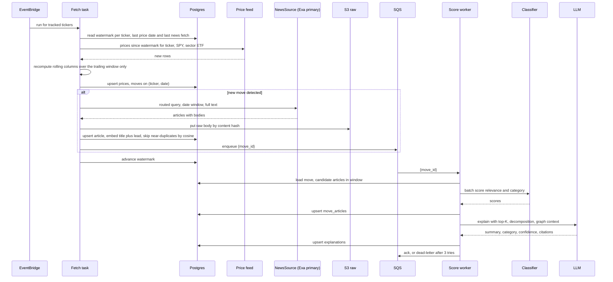

# Architecture v2 — production on AWS

## What changes and what does not

The core pipeline and the API contract stay the same: prices → move detection → decomposition and routing → news fetch → scoring → explanation, exposed as `GET /tickers/{ticker}`, `GET /tickers/{ticker}/moves/{date}`, `POST /chat`, and the same JSON shapes. `ModelProvider` stays as the seam. What changes is everything around that seam. Ingest moves from lazy-on-request to scheduled and incremental, with a queue between fetch and scoring. SQLite becomes RDS Postgres with pgvector, and raw article bodies go to S3. A paid full-text provider (Exa) becomes the primary `NewsSource` implementation; `GoogleNewsRSS` and `GDELTSource` stay behind the same protocol as fallbacks. The LLM stops scoring articles; a fine-tuned relevance and category classifier, trained on the labels v1 accumulated in `move_articles`, does that, and the LLM writes only the prose. The company ontology becomes a knowledge graph, in Postgres first. Keys live in Secrets Manager, logs and metrics in CloudWatch, and the chat page is a small static UI on S3 + CloudFront.

## Component diagram

Ontology choice: start with Postgres adjacency (`company_edges(src, dst, relation, weight)`). The v2 queries are one or two hops (peers, suppliers, sector siblings), which are joins. Move to Neptune only when a query needs variable-depth traversal (supply-chain contagion three hops out) and the recursive CTE becomes the slow path.

## Incremental ingest flow

Idempotency is unchanged from v1: `(ticker, date)` on prices and moves, `url` on articles, `move_id` on explanations. A retried message rewrites the same rows.

Semantic dedupe: an article is skipped when its embedding is within a cosine threshold of an existing article in the same date window. This collapses syndicated copies that v1's URL dedupe cannot see. The same embeddings give cross-ticker retrieval: "what else moved on this story" is a nearest-neighbour query over `articles` joined to `move_articles`.

## From v1 labels to the v2 classifier

### Training set from `move_articles`

Every row v1 writes to `move_articles` is a weak label: `(move context, article) → (relevance, category)`. In v1 the label comes from the LLM or the heuristic, so the raw table is silver, not gold. The path to a classifier:

| step | what | why |
|---|---|---|
| 1 | Export `move_articles` joined to `moves` (routing, ret_z, near_earnings, peer_comove) and `articles` (title, source, and body once available) | The classifier input is the pair, not the article alone |
| 2 | Keep only rows scored by `AnthropicProvider`; drop heuristic rows or mark them as a separate weak source | Heuristic labels are keyword hits and would teach the model to count keywords |
| 3 | Hand-label a stratified sample: ~300 pairs across category, relevance bucket, and ticker | Measures LLM label noise and gives a gold eval set |
| 4 | Fine-tune a small encoder (DeBERTa-class) with two heads: relevance regression, category 3-way | Cheap to serve, batch-scores hundreds of articles per move in milliseconds |
| 5 | Report agreement with the gold set per category; ship only if it beats the LLM labeler on gold | The goal is cheaper at equal quality, not cheaper |
| 6 | Keep the LLM scoring path behind a flag for a shadow percentage of moves | Continues to grow the silver set and catches drift |

The provider interface makes this a config change: `ClassifierProvider.score()` replaces `AnthropicProvider.score()`, and `explain()` still calls the LLM.

### Calibrating confidence so `unexplained` is trustworthy

v1's confidence is a number the LLM emits. v2 makes it a probability that the explanation is right.

- Build a hand-labeled move set: ~200 moves across tickers, sectors, and routing buckets. For each, a human records the primary category and whether the day's news explains the move at all.
- Run the pipeline on those moves and collect `(emitted confidence, correct or not)`.
- Fit isotonic regression (or Platt scaling if the set is small) from emitted confidence to observed accuracy. Store the map as a versioned artifact and apply it at read time.
- Set the `unexplained` threshold from the calibration curve: mark a move unexplained when calibrated confidence is below the point where precision of "explained" drops under a target (say 0.8). That target is a product decision and lives in config.
- Track calibration error (ECE) and the unexplained rate per week in CloudWatch. A drift alarm means the news source or the classifier changed under us.

The point: a user who reads "unexplained" should be able to trust that the system looked and found nothing, not that the model was hedging.

## Migration table

| v1 component | v2 component | why |
|---|---|---|
| Lazy ingest on first `GET` | EventBridge → Fargate fetch task → SQS → score worker | Data is fresh before anyone asks; request latency is a read, not a fetch |
| Full re-ingest per call | Incremental by per-ticker watermark | Only new days and new articles are fetched; cost is proportional to change |
| In-process scoring | SQS-decoupled worker | Fetch failures and model failures retry independently; back-pressure is visible |
| SQLite `data/app.db` | RDS Postgres + pgvector | Concurrent writers, backups, embeddings in the same store as the join |
| No article body | S3 raw bodies, keyed by content hash | Full text for scoring and for re-labeling later; cheap to keep forever |
| URL dedupe | URL plus embedding cosine dedupe | Syndicated copies collapse; cross-ticker retrieval comes free |
| `GoogleNewsRSS` primary, `GDELTSource` fallback, titles only | Exa primary as a third `NewsSource` implementation, RSS and GDELT kept as fallbacks | Full text, real urls instead of Google redirects, no 5 s throttle; the free sources keep zero-key resilience |
| `AnthropicProvider.score()` | Fine-tuned classifier on SageMaker or Fargate | Per-article scoring is the volume cost; a small encoder is cheaper and more consistent |
| `AnthropicProvider.explain()` | Bedrock or Anthropic API, prose only | One call per move, low volume; keep the model that writes well |
| `companies.peers_json` | `company_edges` adjacency in Postgres, Neptune later | Typed relations (peer, supplier, customer) as a table; graph DB only when traversals demand it |
| `.env` keys | Secrets Manager | Rotation and per-service scoping |
| stdout logging | CloudWatch logs, metrics, alarms | Unexplained rate, queue depth, provider errors are dashboards, not greps |
| Static HTML on FastAPI `/` | S3 + CloudFront static UI, same `fetch` to `/chat` | Serves without touching the API service; still no framework required |
| Uncalibrated confidence | Isotonic map from a labeled move set | `unexplained` becomes a measured claim |
| Single-day moves | Unchanged in v2 first cut; multi-day windows deferred | Same detector; window logic is a later extension |

## Cost and complexity: build first, defer

Build first, in order:

1. **Postgres + Fargate API.** Same code, `DATABASE_URL` swap. Unblocks everything else.
2. **Scheduled incremental ingest with SQS.** The single biggest behaviour change; makes the system fresh and bounded in cost.
3. **Paid news with bodies to S3.** One more `NewsSource` implementation, no pipeline change. Better inputs beat better models; bodies also make the labeling work below possible.
4. **Hand-labeled move set and calibration.** ~200 moves is a few days of labeling and it makes every confidence number meaningful. Do this before the classifier so the classifier has a gold eval.
5. **Classifier replacing LLM scoring.** Only once the silver set is large enough (tens of thousands of pairs) and gold eval exists.

Defer:

- **Neptune.** Postgres adjacency covers one- and two-hop queries; no v2 query needs more.
- **pgvector cross-ticker retrieval.** Dedupe is the first use; the retrieval feature waits for a chat question that needs it.
- **SageMaker.** A Fargate service with the model in the container is simpler until throughput demands autoscaling on GPU.
- **React UI.** The static page is fine; a framework arrives with a real front-end need, not with the move to AWS.
- **Social and executive commentary.** Different ingestion model (streams, not date-windowed queries) and different licensing; a separate project.
- **Multi-day move windows.** Changes the detector and the labels; wait until single-day calibration is stable.

Rough steady-state cost for ~500 tickers, daily: Fargate API and worker on the smallest tasks, one `db.t4g.medium` Postgres, a few GB in S3, one paid news plan, and LLM prose for perhaps 50 new moves a day. Low hundreds of dollars a month. The classifier is what keeps it there; per-article LLM scoring would be the first line item to grow.
