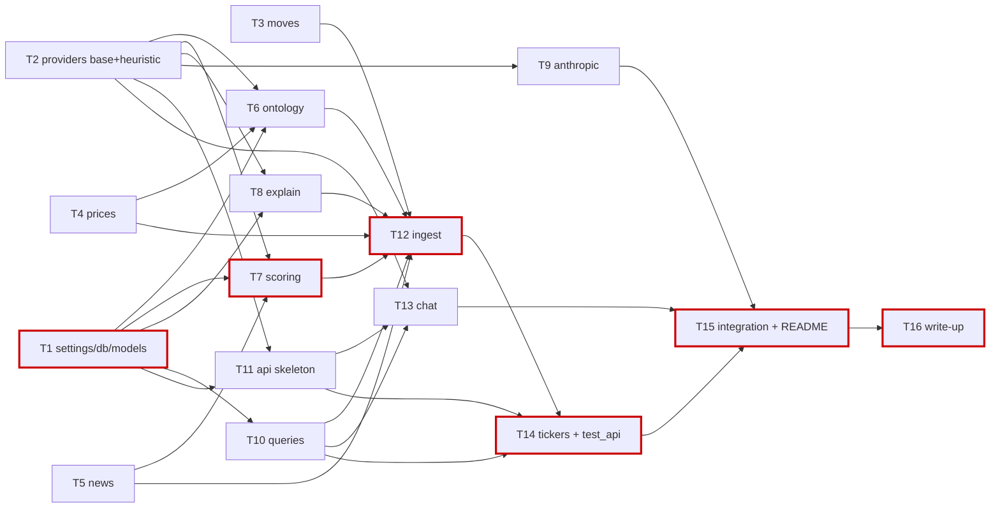

# v1 implementation plan — task DAG for parallel coding agents

Source of truth for every decision: `DESIGN.md` (read it first, every task). Data model
detail: `docs/architecture-v1.md`. Machine-readable twin of this file: `docs/v1-dag.yaml`
(the `prompt` field there is handed to each agent verbatim).

## Goal

Ship the v1 local prototype from DESIGN.md in ~2 h of parallel agent time plus 30 min of
integration: a FastAPI + SQLite service (`src/stock_moves`) that ingests a ticker's daily
prices from yfinance, flags major moves by rolling z-score, decomposes each move into
market / sector / idiosyncratic components, routes a keyless news query (Google News RSS
primary, GDELT fallback) per routing bucket, scores and links articles through a
`ModelProvider` (Anthropic when keyed, heuristic otherwise), caches structured
explanations, and exposes `GET/POST /tickers/...`, `POST /chat` and a static chat page.
Zero keys required to run and test.

Already done (T0, not in the DAG): package renamed to `stock_moves`, project renamed to
`stock-move-explainer`, dependencies installed with uv.

## Ground rules that shape the DAG

- **File ownership is disjoint inside a wave.** Two tasks that can run at the same time never
  touch the same file. A later task may overwrite a stub that an earlier task created.
- **Signatures are fixed here, not by the agent.** Dependents code against the signatures in
  this plan before the upstream lands. Change a signature only by editing this plan.
- **Wave 1 modules import nothing from each other.** They share types by duck-typing
  (`MoveContext.from_objects(move, company)` reads attributes by name) and by re-declaring two
  tiny vocabularies (`MACRO_TERMS` in `providers/base.py`, `MACRO_QUERY_TERMS` in
  `news/base.py`). That duplication is deliberate.
- **Fetchers are resolved at call time**, never bound as default arguments, so tests can
  `monkeypatch.setattr("stock_moves.prices.fetch_ohlcv", fake)`.
- **Storage rule for moves** (from `docs/architecture-v1.md`): a `moves` row exists for any day
  passing the *ingest-time* thresholds (defaults 2.0 / 0.02, overridable on `POST .../ingest`);
  GET-time thresholds filter stored rows. To see smaller moves, re-ingest with lower thresholds.
- Every task ends with `uv run ruff check . && uv run ruff format --check . && uv run pytest -q`
  green, and a report naming the exact files changed.

## Waves and timeline (one agent per task; minutes are per task)

| Wave | Starts at | Tasks |
|---|---|---|
| 1 interfaces + pure functions | 0:00 | T1 settings/db/models · T2 providers base+heuristic · T3 moves · T4 prices · T5 news |
| 2 domain modules | ~0:35 | T6 ontology · T7 scoring · T8 explain · T9 anthropic provider · T10 queries · T11 api skeleton |
| 3 orchestration | ~1:05 | T12 ingest · T13 chat |
| 4 read API | ~1:40 | T14 tickers routes + test_api |
| 5 finish | ~2:10 | T15 integration + README |
| 6 write-up | ~2:40 | T16 write-up (after T15; can be drafted while T15 runs) |

**Critical path (bold in the DAG): T1 → T7 → T12 → T14 → T15 → T16**, about 170 min end to
end. Wave 1's longest task is T3 (35 min); wave 2 cannot start before T1 and T2 land, so T1 and
T2 should be given to the fastest agents.

## Task list

Signatures below are normative. Each entry: owns → files it creates/edits; exposes → public
API; check → acceptance; deps → task ids.

### Wave 1

**T1 — settings, engine, tables** *(critical, 25 min)*
owns `src/stock_moves/settings.py`, `db.py`, `models.py`, `tests/conftest.py`, `tests/test_models.py`.
exposes `Settings` (pydantic BaseModel; fields `anthropic_api_key`, `anthropic_model="claude-opus-5"`, `news_source="google_rss"`, `db_path=Path("data/app.db")`, `default_period="1y"`, `default_top_n=10`, `default_z_threshold=2.0`, `default_pct_threshold=0.02`, `top_k_articles=8`, `news_limit=30`, `gdelt_throttle_s=5.0`, `http_timeout_s=20.0`), `get_settings()` (lru_cached, reads `.env` via python-dotenv, env names upper-cased); `configure_engine(url) -> Engine`, `get_engine()`, `init_db()`, `get_session()` (generator for Depends), `session_scope()` (contextmanager); SQLModel tables `Company, Price, Move, Article, MoveArticle, Explanation, ChatMessage` with the columns in `docs/architecture-v1.md`; conftest fixture `session` (in-memory SQLite, StaticPool, tables created).
check `tests/test_models.py`: create all tables in memory, insert one row per table, unique `(ticker,date)` on prices raises IntegrityError on duplicate.
deps none.

**T2 — ModelProvider protocol, heuristic provider, tool specs** *(30 min)*
owns `src/stock_moves/providers/__init__.py`, `providers/base.py`, `providers/heuristic.py`, `tests/test_heuristic_provider.py`.
exposes dataclasses `ArticleInput`, `MoveContext` (+`from_objects(move, company)`), `ArticleScore`, `ExplanationResult`, `ChatTurn`, `ToolCallRecord`, `ChatReply`; `MACRO_TERMS`; `TOOL_SPECS` (Anthropic tool format for `list_moves`, `get_move`, `search_news`); `class ModelProvider(Protocol)` with `name`, `score_articles`, `explain`, `suggest_peers`, `chat`; `HeuristicProvider`; `get_provider(settings=None)` (Anthropic if key set and importable, else heuristic).
check heuristic scores a title containing the company name at relevance 1.0/company, a macro term at 0.5/macro; `explain` with no relevant articles and |z|<3 returns `unexplained=True`; `chat("what happened to TEST on 2025-06-03")` calls the `get_move` tool once.
deps none.

**T3 — move maths (pure pandas/numpy)** *(35 min)*
owns `src/stock_moves/moves.py`, `tests/synth.py`, `tests/test_moves.py`.
exposes `compute_returns`, `rolling_z`, `volume_z`, `decompose` (trailing 60-day OLS, numpy lstsq, betas from the window ending the previous day), `route`, `regime`, `near_earnings`, `peer_comove`, `build_features`, `detect_moves`; test helper `synthetic_ohlcv(n_days, seed, shocks)`.
check synthetic 320-day frame with an injected −8 % day: `detect_moves` returns exactly that day at the defaults, `direction == "down"`, every DESIGN column present; `route` tie-break and NaN rules; `regime` bull/bear; `near_earnings` ±1 trading day by position.
deps none.

**T4 — yfinance prices, sector ETF map, earnings dates** *(25 min)*
owns `src/stock_moves/prices.py`, `tests/test_prices.py`.
exposes `SECTOR_ETF`, `MARKET_ETF="SPY"`, `TickerInfo`, `PriceFetchError`, `normalize_ohlcv(raw)`, `fetch_ohlcv(ticker, period="1y")`, `fetch_info(ticker)`, `fetch_earnings_dates(ticker)`, `sector_etf_for(sector)`, `fetch_peer_returns(peers, period)`.
check `normalize_ohlcv` on a tz-aware, capitalised yfinance-shaped frame gives lower-case columns and a tz-naive `date` index; `sector_etf_for("Technology") == "XLK"`, unknown → `None`. Network calls are not exercised in pytest.
deps none.

**T5 — news sources: protocol, Google News RSS (primary), GDELT (throttled)** *(35 min)*
owns `src/stock_moves/news/__init__.py`, `news/base.py`, `news/google_rss.py`, `news/gdelt.py`, `tests/test_news.py`.
exposes `NewsItem`; `NewsSource` protocol `search(query, start, end, limit) -> list[NewsItem]`; `MACRO_QUERY_TERMS`; `clean_company_name`, `build_query(bucket, ...)`, `window_for(move_date)`, `queries_for_move(routing, ...)`, `get_news_source(name)`; `GoogleNewsRSS` (stdlib `xml.etree`, `after:`/`before:` operators); `GDELTSource` (5 s client-side throttle); both pure parsers `parse_rss(xml_text)`, `parse_gdelt(payload)`.
check parsers on inline fixtures; `build_query("company", "Apple Inc.", "AAPL", ...)` starts with `"Apple" stock`; `GoogleNewsRSS.search` with a fake `httpx.Client` transport returns dated items with source names and no duplicates; GDELT throttle sleeps when called twice inside 5 s (monkeypatched `time`).
deps none.

### Wave 2

**T6 — company ontology** *(20 min)* owns `ontology.py`, `tests/test_ontology.py`. exposes `upsert_company`, `get_or_build_company(session, ticker, provider, *, refresh=False)`, `peers_of`. check fake `fetch_info` + heuristic → row with `peers_json="[]"`, idempotent, `refresh` re-fetches. deps T1, T2, T4.

**T7 — article scoring and linking** *(critical, 30 min)* owns `scoring.py`, `tests/test_scoring.py`. exposes `upsert_articles(session, items)`, `score_and_link(session, move, company, articles, provider)`. check dedupe on URL; heuristic link relevance/category; re-run replaces links, no duplicates. deps T1, T2, T5.

**T8 — explanation cache** *(30 min)* owns `explain.py`, `tests/test_explain.py`. exposes `get_or_create_explanation(session, move, company, provider, *, top_k=8, refresh=False)`. check second call returns the same row id; `refresh=True` recomputes. deps T1, T2.

**T9 — AnthropicProvider** *(30 min)* owns `providers/anthropic.py`, `tests/test_anthropic_provider.py`. exposes `AnthropicProvider(api_key, model, client=None)` implementing `ModelProvider`; structured outputs via `client.messages.parse(..., output_format=PydanticModel)`, chat via the manual tool loop, heuristic fallback on any API error. check with a fake client object, no network. deps T2.

**T10 — read queries and JSON shapes** *(25 min)* owns `queries.py`, `tests/test_queries.py`. exposes `MoveFilters`, `list_moves`, `get_move`, `get_company`, `has_prices`, `list_prices`, `articles_for_move`, `get_explanation`, `search_news`, `save_chat_message`, `chat_history`, `move_to_dict`, `article_to_dict`, `explanation_to_dict`, `price_to_dict`. check filters (direction, thresholds, category, min_relevance, limit) on seeded rows. deps T1.

**T11 — API skeleton, schemas, static page, router stubs** *(30 min)* owns `api/__init__.py`, `api/app.py`, `api/deps.py`, `api/schemas.py`, `api/static/index.html`, stub `api/tickers.py`, stub `api/chat.py`, `tests/test_app_smoke.py`. exposes `create_app(settings=None)`, `app`, `get_db`, `get_provider_dep`, pydantic response models. check `GET /` is HTML 200, `GET /docs` 200, `GET /openapi.json` 200. deps T1, T2.

### Wave 3

**T12 — ingest orchestration** *(critical, 35 min)* owns `ingest.py`, `tests/test_ingest.py`. exposes `IngestResult`, `ingest_ticker(session, ticker, *, period, top_n, z_threshold, pct_threshold, refresh, provider=None, news_source=None)`, `enrich_move(session, move, company, provider, news_source, *, refresh=False)`. check monkeypatched fetchers: prices/moves rows written, top-N moves have links and explanations, second run adds no rows. deps T3, T4, T5, T6, T7, T8, T10.

**T13 — chat endpoint** *(30 min)* owns `api/chat.py` (overwrites stub), `tests/test_chat.py`. exposes `make_tools(session, default_ticker)`, `POST /chat`. check heuristic reply names the ticker and date; `tool_calls` non-empty; `session_id` returned and reused. deps T2, T10, T11.

### Wave 4

**T14 — ticker routes + end-to-end API test** *(critical, 35 min)* owns `api/tickers.py` (overwrites stub), `tests/test_api.py`. exposes `POST /tickers/{t}/ingest`, `GET /tickers/{t}`, `GET /tickers/{t}/moves/{date}` with every filter in DESIGN §6; lazy populate on first GET; `?refresh=true`. check TestClient with heuristic provider and monkeypatched price/news fetch: first GET ingests, shock date present with an explanation, filters work, second GET makes no fetch calls. deps T10, T11, T12.

### Wave 5

**T15 — integration run, wiring fixes, README** *(critical, 30 min)* owns `README.md`, `src/stock_moves/__init__.py`, `.gitignore`, `data/.gitkeep`, plus any file for wiring fixes (sequential, no contention). Runs the server, ingests AAPL for real, exercises the curls, fixes what breaks, writes run instructions and example curls. deps T9, T13, T14.

**T16 — submission write-up** *(critical, 15 min)* owns `docs/WRITEUP.md`. Answers the four submission questions, briefly, from what was actually built. deps T15.

## DAG

## How an agent should execute a task

1. Read `/Users/thejasprasad/Documents/tetrix-take-home/DESIGN.md` in full, then
   `docs/architecture-v1.md` if the task touches tables or endpoints, then the task prompt from
   `docs/v1-dag.yaml`. Do not change DESIGN.md or this plan.
2. Touch only the files listed under `owns`. If you believe another file must change, do not
   change it: describe the needed change in your report and code around it locally.
3. Implement exactly the signatures given. Add private helpers freely; do not rename or widen
   public ones. Type-hint everything; Python 3.12; no new dependencies.
4. If an upstream module you depend on has not landed yet, code against its documented
   signature and write the test so it exercises your code, not the upstream.
5. Before reporting, run from the repo root:
   `uv run ruff check . && uv run ruff format . && uv run pytest -q`. All green, or say
   exactly what is red and why.
6. Report: the exact files created/edited (absolute paths), the public names exposed, the
   test command and its result, and any deviation from the task text.
7. Never make a network call inside pytest. Network is only for T15's manual run.

## Open item

The four submission questions are not in this repo (the prompt arrives with the take-home).
The coordinator appends them verbatim to T16's prompt under `--- QUESTIONS ---` before handing
it out; T16's prompt says what to do if that section is empty.
